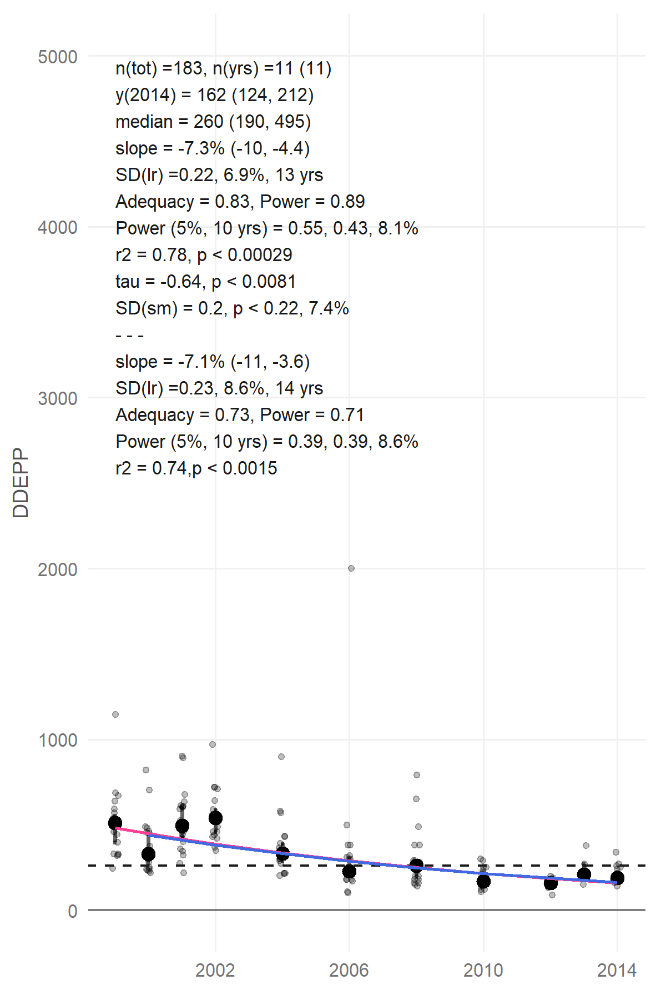

# Temporal analysis of contaminats function, taCont()

An R function written to perform temporal trend analysis on contaminants data.

## Statistical Analysis:

The temporal trends are analyzed using a robust regression approach to detect trends, based on the work of Nicolson et al. 1998 and on the methods used in the PIA computer application developed by Anders Bignert and co-workers [AMAP](https://www.amap.no/documents/doc/pia-application-version-051113/1026).[^1],[^2] In short, the median concentration was used as a yearly contaminant index value, the median was used as it is less influenced by censored data i.e. concentrations below the limit of quantification (>LOQ) and possible outliers. The total variation over time was analyzed using both a linear and non-linear component, while the latest 10 year of data were analyzed by a linear component only. A log-linear regression analysis was used to describe the linear component and a three-year running mean smoother was used to describe the non-linear component. These two component were tested by means of an ANOVA.[^1]

All statistical trend analyses were performed in R version 3.4.2.[^3] A script was written for the temporal trend analysis, allowing quick analysis of multiple contaminants at once (see supplementary data for the r script), the script utilizes a number of r packages. The tidyverse package is used for data wrangling and plotting.[^fn4] The zoo package is used for the running mean smoother.[^5] To calculate the medians when the concentrations include censored data the regression on order statistics (ROS) method is used,[^6],[^7] which is implemented in the NADA package.[^8] To calculate the 95 % confidence intervals (CI) of the medians the bootstrap method from the boot package is used.[^9],[^10] The Mann-Kendall trend test is from the Kendall package.[^11]


## The function tacont() has the variables:

```
taCont <- function(date, y, censored = NULL, plot=TRUE, pub=TRUE, palmost=TRUE,
                   cenPerc = NULL, onlyRes=FALSE)
```

* **date** is given as date or year (ONLY works for year at the moment!!!)
* **y** is either the contaminant, stable isotope or biometric value
* **censored** is a logical vector (TRUE/FALSE) stating if y is censored or not. TRUE means that the y is censored i.e. <LOQ
* **plot** TRUE/FALSE, TRUE by default.
* **pub** TRUE/FALSE, if TRUE the key statistical values are printed on the plot
* **palmost** TRUE/FALSE, models with p<0.05 are plotted as solid lines, p (p almost) between 0.05 and 0.1 are plotted as dashed lines. palmost is TRUE by default
* **cenPerc** is the percentage of allowed cencored data per year, the default is 80
* **onlyRes** TRUE/FALSE, FALSE by default, if true then the list results only contains the dataframe and not the plot

### The result from the function is **a list with up to four elements**, depending on dataset and the chosen variables in the function *plot* and *onlyRes*

1. ggplot
2. data.frame with key results
3. log-linear regression model for the whole dataset
4. log-linear regression model for the last 10 years of the dataset

### example of resulting plot



# References

[^1]: Techniques, I.; Marine, I. N.; Sciences, E.; Nicholson, M. D.; Fryer, R. J.; Larsen, J. R. Temporal Trend Monitoring: Robust Method for Analysing Contaminant Trend Monitoring Data; 1998.

[^2]: Bignert, A. PIA Statistical Application Developed for Use by the Arctic Monitoring and Assessment Programme; 2016.

[^3]: Team, R. C. R: A Language and Environment for Statistical Computing. R Foundation for Statistical Computing: Vienna, Austria 2017.

[^4]: Wickham, H. Tidyverse: Easily Install and Load the “Tidyverse.” 2017.

[^5]: Zeileis, A.; Grothendieck, G. Zoo: S3 Infrastructure for Regular and Irregular Time Series. J. Stat. Softw. 2005, 14 (5), 1–27.

[^6]: Helsel, D. R. Statistics for Censored Environmental Data Using Minitab® and R: Second Edition; 2011.

[^7]: Annan, S. Y. Comparison of the Kaplan-Meier, Maxilllum Likelihood, and ROS Estimators for Left-Censored Data Using Simulation Studies. 2009, 1–9.

[^8]: Lee, L. NADA: Nondetects and Data Analysis for Environmental Data. 2017.

[^9]: Canty, A.; Ripley, B. Boot: Bootstrap R (S-Plus) Functions. 2017.

[^10]: Davidson, A. C.; Hinkley, D. V. Bootstrap Methods and Their Applications; Cambridge University Press: Cambridge, 1997.

[^11]: McLeod, A. I. Kendall: Kendall Rank Correlation and Mann-Kendall Trend Test. 2011.
